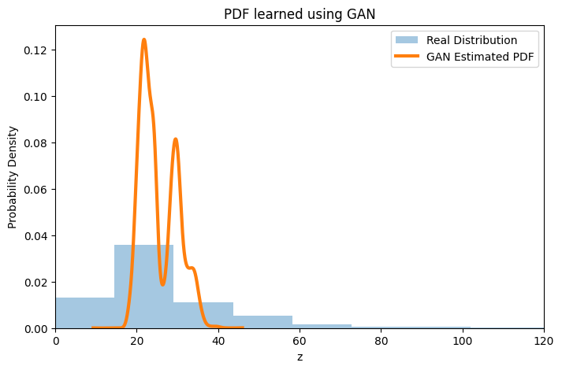

# Learning Probability Density Functions using GANs 

**BY**: Gurkirat Singh  
**Roll Number**: 102303256  
**Group**: 3C21 

This project implements a Generative Adversarial Network (GAN) to learn and approximate an unknown probability density function (PDF) based solely on transformed environmental data.
All results and analyses were generated from the execution of [`Untitled41.ipynb`](https://github.com/Gurkirat90/PDFs/blob/main/Untitled41.ipynb).

---

##  Methodology

The objective is to train a GAN to model the distribution of a transformed variable $z$ without assuming a parametric form (like Gaussian or Exponential) 

---

### Data Preparation and Transformation

---

 - Feature Selection: The $NO_{2}$ concentration from the India Air Quality dataset is used as the base feature $(x)$. 
 - Transformation: Each value $x$ is transformed into $z$ using the periodic function :
   

   $$z = x + a_r \cdot \sin(b_r \cdot x)$$

   The parameters $a_r$ and $b_r$ are derived from the university roll number ($r$).
   For this implementation ($r = 102303256$):
   
$a_r = 0.5 \cdot (102303256 \pmod 7) = 3.0$ 

   
$b_r = 0.3 \cdot (102303256 \pmod 5 + 1) = 0.6$ 

   
 - Normalization: The transformed data $z$ is scaled to the range $[-1, 1]$ using MinMaxScaler to ensure stability during GAN training.

---

###  GAN Architecture

---

Normalization: The transformed data $z$ is scaled to the range $[-1, 1]$ using MinMaxScaler to ensure stability during GAN training.
GAN ArchitectureThe system consists of two competing neural networks: 
- Generator (G):
    - Input: Random noise (latent vector) sampled from $N(0, 1)$.
    - Structure: A multi-layer perceptron (MLP) with hidden layers of 32 units and ReLU activation functions.
    - Goal: To map noise to the distribution of $z$. 
- Discriminator (D):
    - Input: Samples from the real transformed dataset $(z)$ or fake samples from the Generator $(z_f)$. 
    - Structure: An MLP with LeakyReLU activations and a Sigmoid output to produce a probability (0 to 1).
    - Goal: To distinguish between real and generated samples. 
- Training Process
    - Loss Function: Binary Cross-Entropy Loss (BCELoss) is used for both networks.
    - Optimization: The Adam optimizer is employed with a learning rate of $0.0002$.
    - Iterations: The model is trained over $2000$ epochs with a batch size of $128$.

---

##  Results and Analysis

| Parameter | Value |
|----------|-------|
| Roll Number (r) | 102303256 |
| Transformation a_r | 3.0 |
| Transformation b_r | 0.6 |
| Epochs | 2000 |
| Latent Space (Noise) | N(0,1) |
| Optimizer | Adam (LR: 0.0002) |

---

## Graphs

